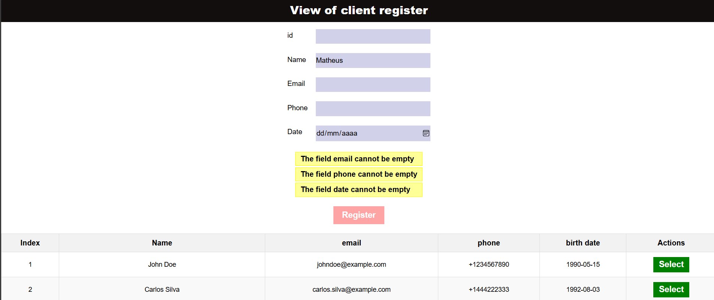
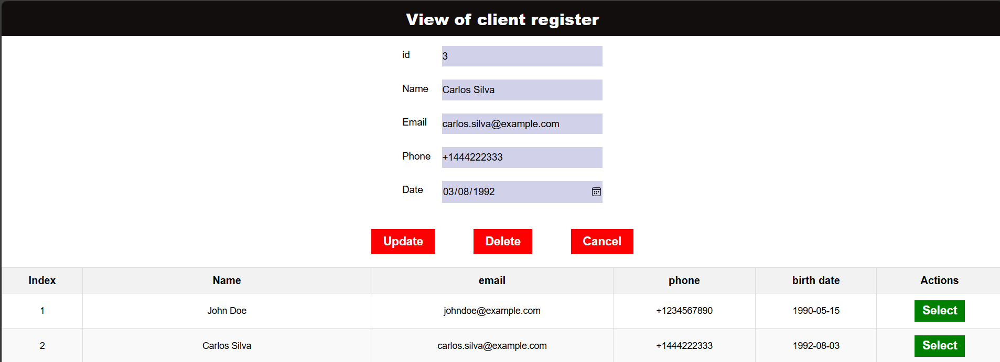

# ✨ Projeto Angular com Integração de API e JSON-Server

Este projeto é uma aplicação frontend desenvolvida com Angular, que se comunica com um backend utilizando o [JSON-Server](https://github.com/typicode/json-server) para fornecer dados simulados. A integração com a API é feita utilizando [RxJS](https://rxjs.dev/), uma poderosa biblioteca para programação assíncrona e manipulação de fluxos de dados.

## 🎞️ Tecnologias Utilizadas

- **Angular**: Framework utilizado para a construção da aplicação frontend.
- **RxJS**: Biblioteca para a manipulação de fluxos de dados reativos e assíncronos.
- **JSON-Server**: Backend simulado para fornecer dados via API RESTful.
- **TypeScript**: Linguagem utilizada para o desenvolvimento da aplicação Angular.

## 👜 Funcionalidades

- A aplicação consome dados de uma API fictícia simulada usando JSON-Server.
- Utiliza RxJS para gerenciar os fluxos de dados de forma eficiente e assíncrona.
- Exemplo de integração básica com endpoints RESTful: `GET`, `POST`, `PUT`, `DELETE`.

## 🎯 Tela de cadastro



## 🛠️ Passos para Executar o Projeto

### 1. Clone o repositório
Clone o repositório para o seu computador local utilizando o seguinte comando:

```bash
git clone https://github.com/SEU_USUARIO/SEU_REPOSITORIO.git
```

### 2. Instale as dependências do Angular
Navegue até a pasta do projeto e instale as dependências do Angular:
```bash
npm install
```

### 3. Instale o JSON-Server
O JSON-Server é utilizado para criar uma API simulada. Para instalá-lo globalmente, execute o seguinte comando:

```bash
npx i json-server@0.17.4
```

### 4. Inicie o JSON-Server
Inicie o servidor JSON-Server para que ele simule a API RESTful. Execute o seguinte comando:

```bash
npm json-server produtos.json
```
Isso criará uma API acessível em http://localhost:3000. O JSON-Server irá simular as rotas de GET, POST, PUT, DELETE para os dados definidos no db.json.

### 5. Inicie o servidor Angular
Agora, em um novo terminal, inicie o servidor de desenvolvimento do Angular com o comando:

```bash
ng serve
```
Isso iniciará a aplicação Angular no endereço http://localhost:4200.
